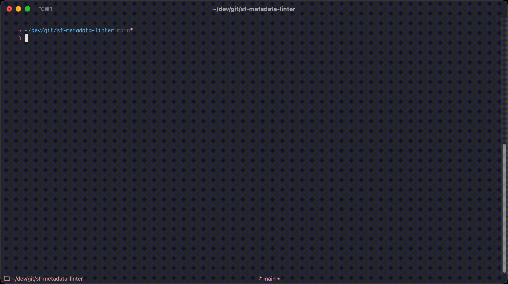

<br>
<p align="center">
  
<!--   <h1 align="center">sf metadata linter</h1> -->
<!--   <hr> -->
  <p align="center">
    <a href="https://github.com/salesforcecli">sf cli</a> plugin to lint metadata
  </p>
</p>
<p align="center">
<a href="https://www.npmjs.com/package/sf-metadata-linter" rel="nofollow"></a>
<a href="https://raw.githubusercontent.com/salesforcecli/sf-metadata-linter/main/LICENSE.txt" rel="nofollow"></a>
</p>

<br>



<br>

## Installation

Assuming you already have the [sf cli](https://developer.salesforce.com/tools/salesforcecli) installed, the plugin can be installed by running:

`sf plugins install sf-metadata-linter`

Note: You'll be prompted that this is not officially code-signed by Salesforce - like any custom plugin. You can just accept this when prompted, or alternatively you can [whitelist it](https://developer.salesforce.com/docs/atlas.en-us.sfdx_setup.meta/sfdx_setup/sfdx_setup_allowlist.htm)

### Updating

The plugin can be updated to the latest version using

`sf plugins update`

<br>

## Usage

### sf metalint run

Run the linter against a set of Salesforce metadata files

```
USAGE
  $ sf metalint run --config ruleset.yaml --directory forceapp/

FLAGS
  -c, --config=<value>  (required) Path to a config.yaml file that defines the rules and options for the linter.
  -d, --directory=<value> (required) Path to a directory containing Salesforce metadata.
  -f, --format=[csv|sarif|table] (optional) Output format of the results (defaults to table which is displayed in the CLI in not specified)

GLOBAL FLAGS
  --json  Format output as json.

DESCRIPTION
  Run the linter against a set of Salesforce metadata files

EXAMPLES
  $ sf metalint run --config /path/to/my/config.yaml --directory forceapp/
  $ sf metalint run --config /path/to/my/config.yaml --directory forceapp/ --format csv
  $ sf metalint run --config /path/to/my/config.yaml --directory forceapp/ --format sarif
```

<br>

## Rules

**See the [wiki documentation](https://github.com/tomcarman/sf-metadata-linter/wiki/Rules) for a full description of the rules.**

| Rule | Purpose |
| --- | --- |
| [no-missing-description-on-objects.ts](https://github.com/tomcarman/sf-metadata-linter/blob/main/src/rules/no-missing-description-on-objects.ts) | Checks that the "Description" field is populated on custom objects. |
| [no-missing-description-on-fields.ts](https://github.com/tomcarman/sf-metadata-linter/blob/main/src/rules/no-missing-description-on-fields.ts) | Checks that the "Description" field is populated on custom fields. |
| [no-missing-description-on-flows.ts](https://github.com/tomcarman/sf-metadata-linter/blob/main/src/rules/no-missing-description-on-flows.ts) | Checks that the "Description" field is populated on flows. |
| [no-missing-description-on-validation-rules.ts](https://github.com/tomcarman/sf-metadata-linter/blob/main/src/rules/no-missing-description-on-validation-rules.ts) | Checks that the "Description" field is populated on validation rules. |
| [description-min-length-on-objects.ts](https://github.com/tomcarman/sf-metadata-linter/blob/main/src/rules/description-min-length-on-objects.ts) | Checks that the "Description" field on custom objects meets a minimum length. |
| [description-min-length-on-fields.ts](https://github.com/tomcarman/sf-metadata-linter/blob/main/src/rules/description-min-length-on-fields.ts) | Checks that the "Description" field on custom fields meets a minimum length. |
| [description-min-length-on-flows.ts](https://github.com/tomcarman/sf-metadata-linter/blob/main/src/rules/description-min-length-on-flows.ts) | Checks that the "Description" field on flows meets a minimum length. |
| [description-min-length-on-validation-rules.ts](https://github.com/tomcarman/sf-metadata-linter/blob/main/src/rules/description-min-length-on-validation-rules.ts) | Checks that the "Description" field on validation rules meets a minimum length. |
| [error-message-min-length-on-validation-rules.ts](https://github.com/tomcarman/sf-metadata-linter/blob/main/src/rules/error-message-min-length-on-validation-rules.ts) | Checks that the "Error Message" field on validation rules meets a minimum length. |
| [no-missing-prefix-on-metadata.ts](https://github.com/tomcarman/sf-metadata-linter/blob/main/src/rules/no-missing-prefix-on-metadata.ts) | Checks for a given prefix on API names of metadata. |
| [no-prefix-on-metadata.ts](https://github.com/tomcarman/sf-metadata-linter/blob/main/src/rules/no-missing-on-metadata.ts) | Blocks a given prefix on API names of metadata. |
| [no-double-spaces-in-picklist-fields.ts](https://github.com/tomcarman/sf-metadata-linter/blob/main/src/rules/no-double-spaces-in-picklist-fields.ts) | Checks for unintended double spaces in picklist labels and values. |
| [no-double-spaces-in-value-sets.ts](https://github.com/tomcarman/sf-metadata-linter/blob/main/src/rules/no-double-spaces-in-value-sets.ts) | Checks for unintended double spaces in value set labels and values. |

<br>

## Config

Configuring which rules run, their level and other options, is managed via a config file that is passed into the linter when executing.

An example config file is available in this repo: https://github.com/tomcarman/sf-metadata-linter/blob/main/example/config.yaml

### Global Settings


| Name            | Description                                                                                                                                                                         | Example                   |
| --------------- | ----------------------------------------------------------------------------------------------------------------------------------------------------------------------------------- | ------------------------- |
| csvFilename     | The name of the file when outputting to CSV.                                                                                                                                        | `results.csv`             |
| sarifFilename   | The name of the file when outputting to SARIF.                                                                                                                                      | `results.sarif`           |
| parentDirectory | This is the path above the specific metadata folders (eg. classes, flows, objects etc). If supplied, it will strip this from the results when rending the CLI table (saving space). | `force-app/main/default/` |

Example

```
config:
  csvFilename: results.csv
  sarifFilename: results.sarif
  parentDirectory: force-app/main/default/
````

### Rule Settings

All rules support the following:

| Name   | Description                                   | Example                       |
| ------ | --------------------------------------------- | ----------------------------- |
| active | (boolean) Controls if the rule is run or not. | `true` or `false`             |
| level  | (enum) The level of the rule.                 | `info`, `warning`, or `error` |

Example

```
rules:
  - name: no-missing-description-on-fields
    active: true
    level: warning
```

#### Rule Options

Some rules can be customised with additional options, see the [rule documentation](https://github.com/tomcarman/sf-metadata-linter/wiki/Rules) for further information.

Example 

```
  - name: description-min-length-on-fields
    active: true
    level: warning
    options:
      - name: minimumLength
        value: 100
```

<br>

## Output formats

Different output formats are available for the results, defined by the `--format` flag.

### Table

- This is the default output format and what is used when no other format is supplied.
- Not all fields are included (eg. rule full description) in order to save space.


<br>

### SARIF

- [SARIF (Static Analysis Results Interchange Format)](https://sarifweb.azurewebsites.net/#Specification) is standardised format for static analysis tools.
- It's supported by various DevOps tools - eg. GitHub, Azure DevOps.
- The SARIF output can be used when running the linter as part of CI/CD pipelines. The results can be shown inline in pull requests.


<br>
<br>

### CSV

- Results can be outputted to a CSV - useful for one-off audits etc.

```
ruleId,filePath,ruleShortDescription,level,startLine,endLine,startColumn,endColumn,ruleFullDescription
no-missing-description-on-fields,objects/Account/fields/Status__c.field-meta.xml,Custom fields should have description.,warning,1,1,,,"Custom fields should have a description, describing how the field is used."
no-missing-description-on-fields,objects/Account/fields/VIP Client__c.field-meta.xml,Custom fields should have description.,warning,1,1,,,"Custom fields should have a description, describing how the field is used."
no-missing-description-on-validation-rules,objects/Account/validationRules/Past_Meeting.validationRule-meta.xml,Validation rules should have description.,warning,1,1,,,"Validation rules should have a description, describing how the rule is used."
description-min-length-on-fields,objects/Account/fields/Information__c.field-meta.xml,Custom field description does not meet the minimum length (100),warning,4,4,18,40,"A custom field should have a description, describing how the field is used. The description should be at least 100 characters long."
error-message-min-length-on-validation-rules,objects/Account/validationRules/Past_Meeting.validationRule-meta.xml,Validation rule error message does not meet the minimum length (100),warning,6,6,19,35,"A validation rule should have a clear error message, describing how the user should resolve the error. The error message should be at least 100 characters long."
no-missing-prefix-on-metadata,objects/Account/fields/Information__c.field-meta.xml,Metadata should have a prefix.,warning,1,1,,,"Metadata of types: field, fieldSet, listView should have one of the following prefixes: ACME_"
no-missing-prefix-on-metadata,objects/Account/fields/Status__c.field-meta.xml,Metadata should have a prefix.,warning,1,1,,,"Metadata of types: field, fieldSet, listView should have one of the following prefixes: ACME_"
no-missing-prefix-on-metadata,objects/Account/fields/VIP Client__c.field-meta.xml,Metadata should have a prefix.,warning,1,1,,,"Metadata of types: field, fieldSet, listView should have one of the following prefixes: ACME_"
no-double-spaces-in-picklist-fields,objects/Account/fields/Status__c.field-meta.xml,Picklist labels and values should not contain double spaces.,error,25,25,27,41,Picklist labels and values should not contain double spaces eg. 'Offer  Made'.

```

<!---->

<br>

## Adding new rules

TBC
